# detect120

**We monitor the 120 Hz grid frequency with low cost equipment to predict power failures and monitor power consumption**

<b> please cite our [paper] (https://dl.acm.org/citation.cfm?id=2993570) on the [BuidSys2016] (http://buildsys.acm.org/2016/) conference precedings, also available on the [arxiv](https://arxiv.org/abs/1611.04633).</b> 

<b> project [website](https://serv.cusp.nyu.edu/~fbianco/detect120/)</b>

This research is done at [CUSP](https://cusp.nyu.edu): CenterforUrban Science and Progress at New York University.

This repository collects the pipeline and some output from our experiments on studying the urban electrical grid's behavior through visible imaging monitoring at subsecond frequency. 
A single camera sited at an urban vantage point offers broad, persistent, real-time coverage granular to individual housing units.

The 60 Hz AC line frequency of an electrical grid in the US induces a 120 Hz flicker in most of lights that it powers, including incandescent, halogen, transitional fluorescent, and some LED sources. This flicker is generally imperceptible to the unaided eye.
The 60 Hz line frequency is universal across the grid and maintained to within ∼ 0.02 Hz but the phase of the voltage driving any particular light (and hence of its flicker) will depend upon the grid’s generating sources, topology and condition of its reactive components (e.g., distribution transformers), and the load local to the light. 
Changes in the phase, as observed in the urban lightscape, indicate changes in the power load. 

To avoid the use of expensive equipment necessary to monitor the 120Hz phase through high speed imaging we chop the image at near-line frequency (119.75 Hz) with a liquid-crystal shutter and thus down-convert the flicker to a beat frequency of ∼ 0.25 Hz, which is then easily imaged at 4 Hz cadence with a small digital camera.

This repository collects the data analysis pipeline for this project, in the directory pipeline, from source selection, to phase identification, and the code used to generate the plots in our publications, plus additional material (many many additional figures, simulations, tests). The data is however not made public, since persistent imaging of urban landscapes is a practice susceptible to privacy concerns.

The steps of the pipeline, and the codes that perform them,  are as follow.

###1 -  First off: You need to decide what is a source. 
Generally that starts with stacking images to get a deep enough image of the night skyline. Use **stackImages.py**. For example:

>$python stackImages.py groundtest1/ESB_c0.7Hz_250ms_2016-05-24-230354 --nstack 20 --showme  --gif
 
This creates a directory **stacks** and stores the aa file recording the image size in it (under the assumptinon that the image size for science images is the same as that of the images used to make the stack.  If the image input has a path it will also create a directory corresponding to the full image path, up to the name (**groundtest1** in this case) 

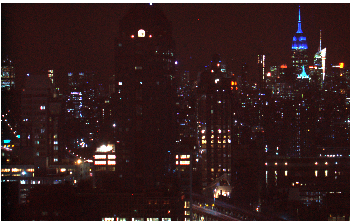

###2 - Find the windows (or light sources) in the stack image. 
We do that by high pass filtering the image and then threshold it. Use **windowsFinder.py** The threshold is set automatically to 90% of the distribution of pixels. It can also be set by hand.

At this point groundtest contains a file storing the image size as a json file
>ls groundtest1/

>ESB_c0.7Hz_250ms_2016-05-24-230354_imgsize.txt 

so the rest of the pipeline will use this info and wont need to find the file size (make sure you analyze images that have the same size as your stack though!)

>$python windowFinder.py stacks/groundtest1/ESB_c0.7Hz_250ms_2016-05-24-230354_N20.npy

**stacks/groundtest1/ESB_c0.7Hz_250ms_2016-05-24-230354_N20.npy** is produced by  stackImages.py

The coordinate file is stored in **ESB_c0.7Hz_250ms_2016-05-24-230354_N20_coords.npy** 

A  **PDF** file of the sources on the scene is also stored: **ESB_c0.7Hz_250ms_2016-05-24-230354_N20_labelledwindows.pdf**

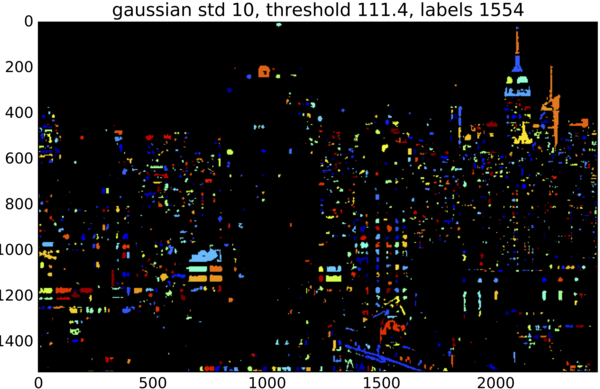

plus a file showing the high pass version of the image, and the pixel distribution, with the selection threshold (red).

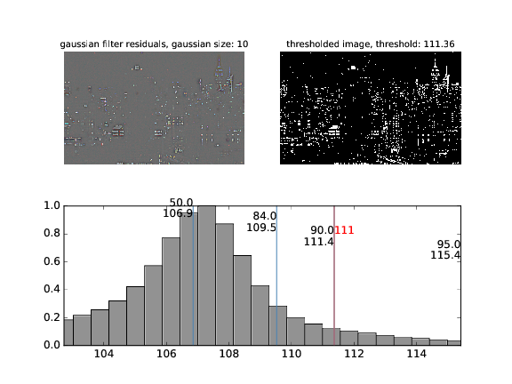

###3 -  Now you can extract the lightcurves and analyze them! 
The code that does all that is **getalllcvPCA.py**
This is a large piece of code (and the docstrings are on still on my todo list)

 >$python getalllcvPCA.py groundtest1//ESB_s119.75Hz_c4.00Hz_100ms_2016-05-24-215440  --nmax 100  --skipfiles 450 --coordfile  stacks/groundtest1/ESB_c0.7Hz_250ms_2016-05-24-230354_N20_coords.npy  --readPCA --stack stacks/groundtest1/ESB_c0.7Hz_250ms_2016-05-24-230354_N20.npy 
 
 we used stacks/groundtest1/ESB_c0.7Hz_250ms_2016-05-24-230354_N20_coords.npy and stacks/groundtest1/ESB_c0.7Hz_250ms_2016-05-24-230354_N20.npy, which are produced by stackImages.py. The other arguments controll the length on the burst to analyze in image (--nmax 100), the beginning of the burst, from the beginning of the run (--skipfiles), and whether to use the product from an earlier analysis, --readPCA (which of course in this case cannoe be done because it is the fist time you run this!)

Now groundtest1 contains several more files: 
ls groundtest1/
>ESB_c0.7Hz_250ms_2016-05-24-230354_imgsize.txt
>ESB_s119.75Hz_c4.00Hz_100ms_2016-05-24-215440.log
>ESB_s119.75Hz_c4.00Hz_100ms_2016-05-24-215440_phases_N0100W1533S0450.dat
>N0100S0450
>N0100W1533S0450

**ESB_s119.75Hz_c4.00Hz_100ms_2016-05-24-215440_phases_N0100W1533S0450.dat** stores the phases for all light with a good fit to a sine wave (the default is to require a chi^2 > 1 to the fit. Tighter ot looser constraints can be set with **--chi2** upon calling getalllcvPCA.py. The name stores the info on which set of images was analyzed in the name as N0100W1533S0450: N number of images in the burst, W number of windows selected by the previous portions of the pipeline, S number of images skipped from the beginning of run. 

**N0100S0450** contains pickle files in (**groundtest1/N0100S0450/pickles**) for all lightcurves extracted. When you rerun the pipeline, as long as you want 100 file lightcurves that start after 450 files from the beginning of the run these will be read in unless you specifically want to extract the lightcurves again. You can force extraction with **--extract**). If the option **--gif** option is used, in **groundtest1/N0100S0450/gifs** and **groundtest1/N0100S0450/pngs** the code stores gifs of the cutout of each light that makes the final cut (43 pixels to the side centered on the source), and a png image with the location of the source,  a cutout of the source, the lightcurve, and the power spectrum of the lightcurve (with the target 0.25Hz frequency marked for reference)

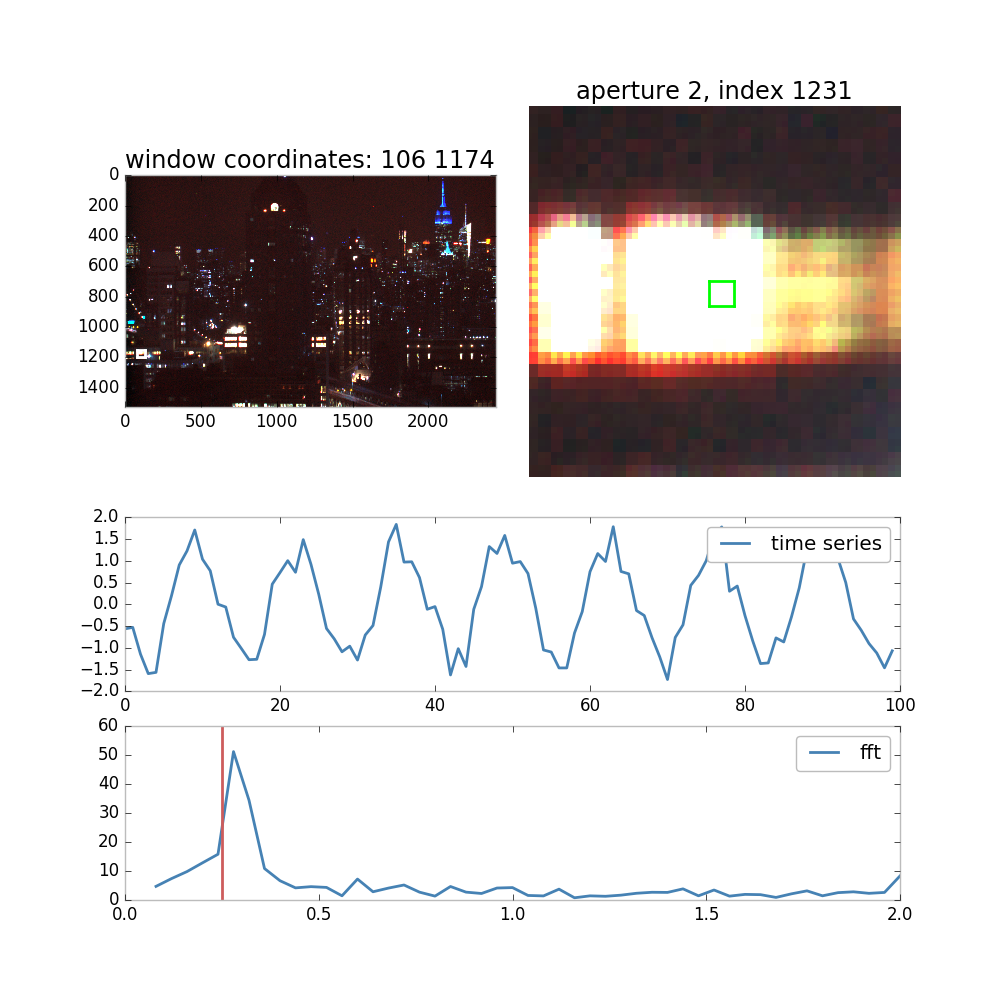

**N0100W1533S0450** contains all the rest of the product for any image set whose path starts with  groundtest1 (if you have more than one run on the same night, for example, and you store the raw data together. Typically we run short ~minute runs at ~15 minutes separation, and analyzem together to detect phase changes.)

At this point **N0100W1533S0450** contains: 
-**ESB_s119.75Hz_c4.00Hz_100ms_2016-05-24-215440_sparklines_lcv.pdf**: sparkline plot of ALL lightcurves in the set. very long PDF. 

-**ESB_s119.75Hz_c4.00Hz_100ms_2016-05-24-215440_PCA.pdf**: the PCA components up to 90% explained variance

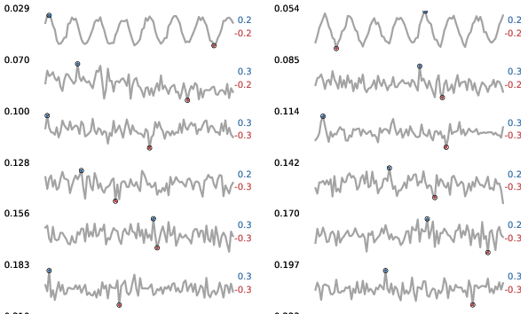

-**ESB_s119.75Hz_c4.00Hz_100ms_2016-05-24-215440_PCAresult.pdf**, and **ESB_s119.75Hz_c4.00Hz_100ms_2016-05-24-215440_PCAresult_log.pdf**: the first and second PCA componet, and the distribution of radii on the PC1-PC2 plane, natural space over r^2, and logspace (in natural space /r^2 the distribution should be flat if the projections were randomely distributed).

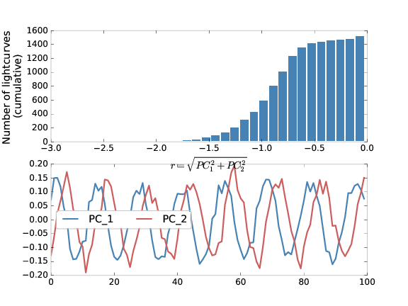

-**ESB_s119.75Hz_c4.00Hz_100ms_2016-05-24-215440_PCAresult_PC1PC2plane.pdf**: projection of the lightcurves in the PC1-PC2 plane, with selection threshold marked

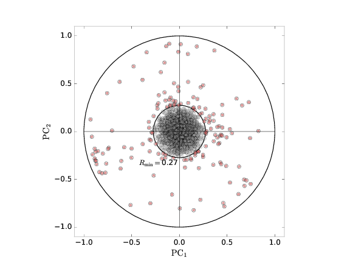

-**ESB_s119.75Hz_c4.00Hz_100ms_2016-05-24-215440_goodwindows.pdf**: the windows that make the final cut overplotted on the scene. 
 
-**ESB_s119.75Hz_c4.00Hz_100ms_2016-05-24-215440_splwfft.pdf**: the PCA selected lightcurves and their power spectra. overplotted is the sine fit to the lightcurve with a phase calculated as arctangent(PC1/PC2). The chi square and the location of the max of the power spectrum are marked on the left and right respectively (when 2 frequencies are tried there re 2 chi squares) A gif of it looks like this:

-**ESB_s119.75Hz_c4.00Hz_100ms_2016-05-24-215440_goodwindows_fits_pca.pdf**: the lightcurves that make the final cut with overplotted sine fit. Labels indicate the pixel location of the light on the scene, the phase and frequency, and the chi square of the sine fit

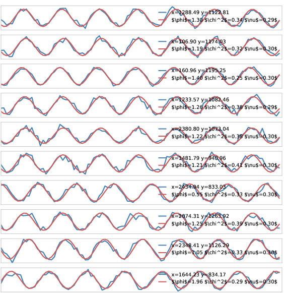

-**ESB_s119.75Hz_c4.00Hz_100ms_2016-05-24-215440_stats.pdf**: distribution of frequencies and phases in the set. the phases are calculated both by the fit and as arctangent of the ratio of the first 2 principal components.

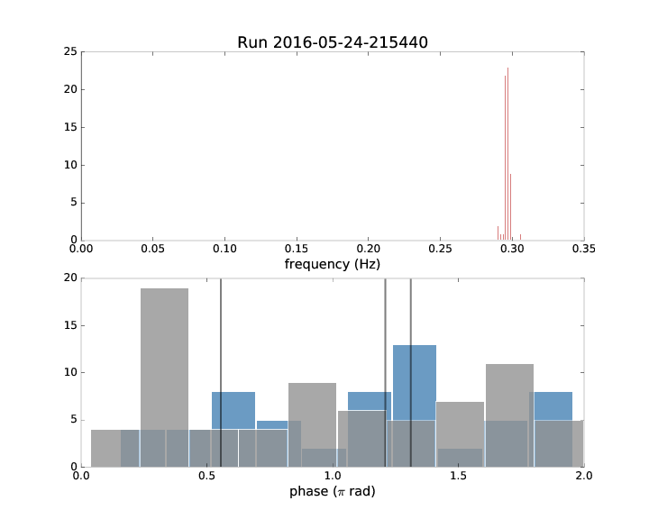

-**ESB_s119.75Hz_c4.00Hz_100ms_2016-05-24-215440_transform.pdf**: the power spectrum and the lightcurve resonstructed by inverting it. only really interesting if the --smooth option is used and at this time it needs testing.

-**ESB_s119.75Hz_c4.00Hz_100ms_2016-05-24-215440_phases.png**: the scene is plotted with the selected windows highlighted in color corresponing to the phase (binned).

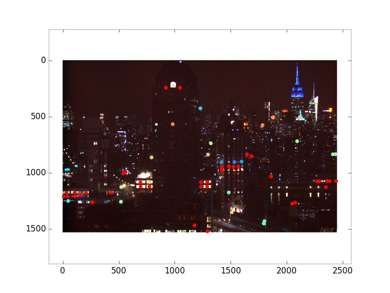

The following results are saved:
-**ESB_s119.75Hz_c4.00Hz_100ms_2016-05-24-215440_bs.npy**: the extracted lightcurves. 

-**ESB_s119.75Hz_c4.00Hz_100ms_2016-05-24-215440_coords.npy**: the coordinates of all lightcurves after removing the NaN lightcurves. This has to be done to use PCA: in fact all missing values are imputed (by mean method across the lcv) 

-**ESB_s119.75Hz_c4.00Hz_100ms_2016-05-24-215440_PCAresult.pkl**: scikit-learn PCA object, the result of the PCA fit

-**ESB_s119.75Hz_c4.00Hz_100ms_2016-05-24-215440_PCAamplitudes.npy**: a npy array file storing the full PCA result. This is an array, fist dimension equal to the total number of lightcurves in the set (lmax)
        PCAr[i][0] = Radius of the projection on the PC1-PC2 plane
 
        PCAr[i][1] = PC1 amplitude
 
        PCAr[i][2] = PC2 amplitude
 
        PCAr[i][3] = ampliture normalization (sqrt of the sum squared of all amplitudes)
 
        PCAr[i][5] = arctangent of PC1-PC2 amplitudes)
 
        PCAr[i][5] = x coordinate
 
        PCAr[i][6] = y coordinate
 
 -**ESB_s119.75Hz_c4.00Hz_100ms_2016-05-24-215440_goodcoords.npy**:
 an array storing the details for the sources that pass the final cut:
 
     goodphases[0] = phases (from fit),
 
     goodphases[1] = index (index in the original coord file),
 
     goodphases[2] = x coordinate,
 
     goodphases[3] = y coordinate,
 
     goodphases[4] = km_cluster (superseded - ignore),
 
     goodphases[5] = chi2 of the sine wave fit,
 
     goodphases[6] = freq (from fit),
 
     goodphases[7] = phase_e upper bound of confidence interval on phase (only if MCMC is run with --mcmc),
 
     goodphases[8] = phase_e lower bound of confidence interval on phase (only if MCMC is run with --mcmc),
 
     goodphases[9] = freq_e upper bound of confidence interval on frequency (only if MCMC is run with --mcmc),
 
     goodphases[10] = freq_e upper bound of confidence interval on frequency (only if MCMC is run with --mcmc)

with the option --mcmc you can run an mcmc simulation to assess the confidence intervals for the phase and frequency bes t fits. This will produce the additional files in **groundtest1/triangles/** with the cornerplot (https://github.com/dfm/corner.py) of the 2 parameters fit.

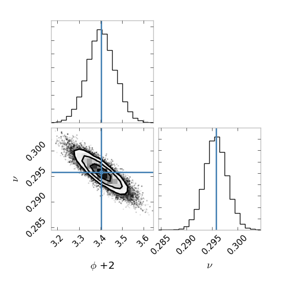

###4 - You can group the windows in families. 
One should consider that some automatically selected windows belong to the same building, even to the same housing unit. Use **lassoselect.py** to create a file containing labels that identify sources grouped together. This is an interactive tool that allows you to select groups of windows as you draw a lasso around them. 

>$python lassoselect.py stacks/groundtest1/ESB_c0.7Hz_250ms_2016-05-24-230354_N20_labelledwindows.npy  groundtest1/N0100W1533S0450/ESB_s119.75Hz_c4.00Hz_100ms_2016-05-24-215440_goodcoords.npy

This code makes and stores the file **stacks/ESB_c0.7Hz_250ms_2016-05-24-230354-0000_20_families.npy** wich contains the "families" of windows. it is a numpy array of families, wach entry containing a list of coordinate pairs (xy pairs)

###5 - Lastly: you can make plots of the phase evolution, 
do that with **makePhasePlot.py**, passing it the earlier products of the pipeline. Yu can do that across the runs, or for several unrsts in a run. You will need to chose a reference source, and pass its coordinates with --ref, and have a families file for the color coding.

To plot a sequence of bursts within a run
>python makePhasePlot.py groundtest1/ESB_s119.75Hz_c4.00Hz_100ms_2016-05-24-215440 --nmax 100  --skipfiles 150 --coordfile stacks/groundtest1/ESB_c0.7Hz_250ms_2016-05-24-230354_N20_coords.npy    --ref 792.81,861.53  --families stacks/ESB_c0.7Hz_250ms_2016-05-24-230354-0000_20_families.npy --onerun N0100W1533

To plot a burst from several runs
>>python makePhasePlot.py groundtest1/ESB_s119.75Hz_c4.00Hz_100ms_2016-05-24-213949 groundtest1/ESB_s119.75Hz_c4.00Hz_100ms_2016-05-24-215440 groundtest1/ESB_s119.75Hz_c4.00Hz_100ms_2016-05-24-220941 groundtest1/ESB_s119.75Hz_c4.00Hz_100ms_2016-05-24-222440 groundtest1/ESB_s119.75Hz_c4.00Hz_100ms_2016-05-24-223940 --nmax 100  --skipfiles 150 --coordfile stacks/groundtest1/ESB_c0.7Hz_250ms_2016-05-24-230354_N20_coords.npy  --families stacks/ESB_c0.7Hz_250ms_2016-05-24-230354-0000_20_families.npy --ref 792,861

This prodices the following lots, which are discussed in our paper (submitted, reference soon)

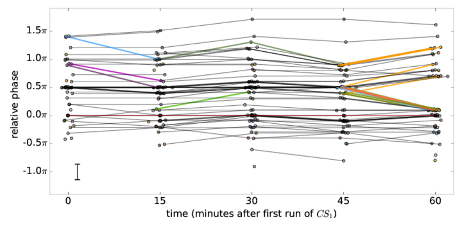

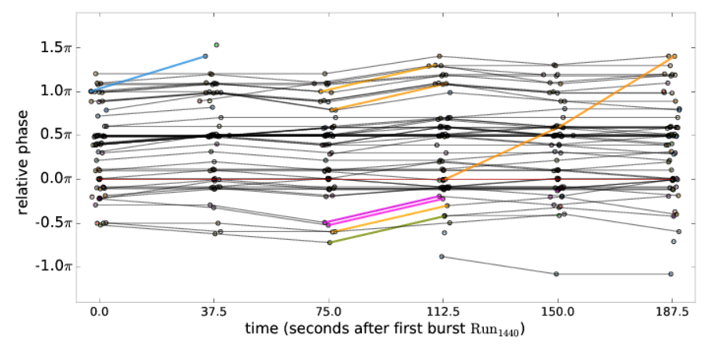

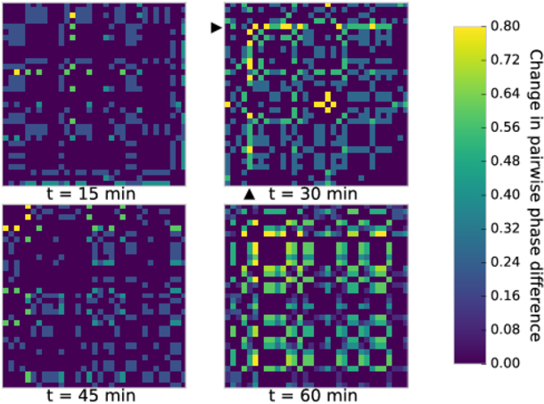

###Additional code: 

**make_freqvsphase_errors.py** makes plots of freq vs phase, with errors, from the MCMC output.

**make120sMovie.py** and **makemovie.py** make GIF movies

**plotone.py** plots the first 6 PCA components and a single source lightcurve, its PC1-PC2 reconstruction and its sine fit( figure 2 of our first paper)

